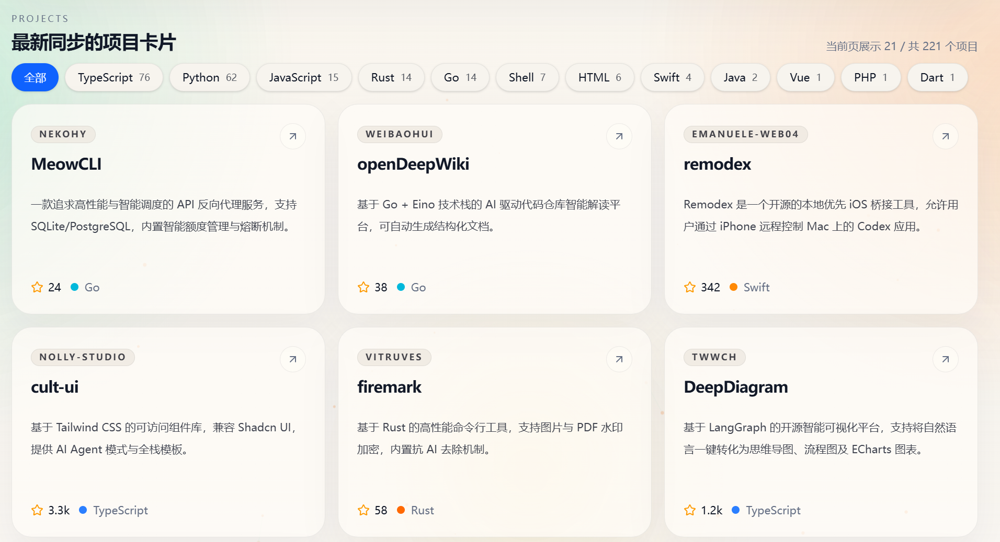
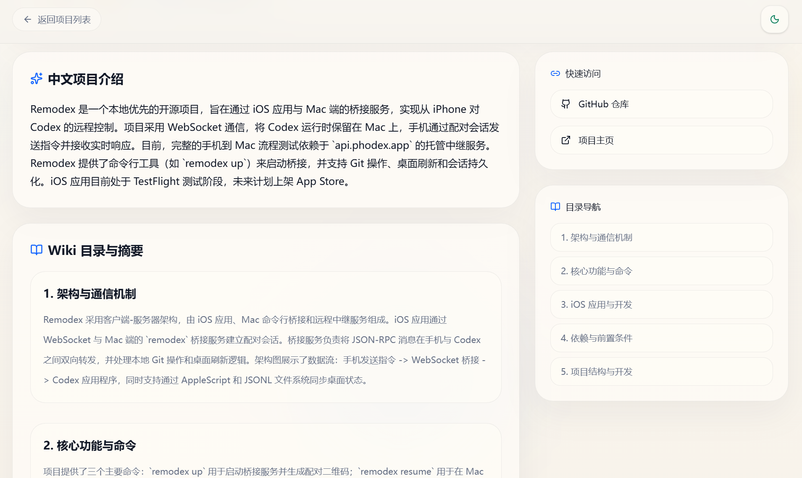

# Star Wiki

## 页面预览

<p align="center">
  
  
  
</p>

Star Wiki 是一个把 GitHub Star 列表整理成“可搜索、可理解、可回看”的个人项目知识库。

它不是简单展示 GitHub 返回的数据，而是围绕“我为什么 Star 它”“它解决什么问题”“以后我怎么再找到它”来重组你的收藏项目。

## 现在已经支持什么

- 同步 GitHub Star 列表
- 为项目生成一句话中文简介
- 生成更完整的中文项目介绍
- 生成详细 Wiki 章节
- 对可分析项目生成思维导图
- 自动识别项目类型、用途、问题定义
- 首页中文搜索与筛选
- 语义搜索排序
- 项目详情页语义相关推荐
- 自动专题页
- `/graph` 项目关系网图谱
- `/admin` 后台配置与重写
- 多阶段队列处理与缓存
- SEO 标题、描述、FAQ、结构化数据

## 项目定位

这个项目更偏“给自己整理 Star”的工具，而不是商业化的开源导航站。

核心目标有三个：

1. 帮你把收藏过的项目沉淀下来
2. 帮你理解每个项目到底是干什么的
3. 帮你在几个月之后还能重新找到它

## 核心能力

### 1. GitHub Star 同步

系统会拉取你的 GitHub Star 仓库信息，包括：

- 仓库名
- 描述
- 语言
- topics
- Star 时间
- 更新时间

### 2. AI 项目理解

系统不是一次性把整个仓库丢给模型，而是走多阶段处理链路：

1. `scan_repo`
   读取 README、目录结构、关键配置文件
2. `analyze_repo`
   分析项目类型、用途、问题定义、推荐深读文件
3. `deep_read_repo`
   对关键文件做更深入理解
4. `generate_profile`
   生成中文介绍、Wiki、SEO 字段、FAQ、思维导图

这样做的目的：

- 更省 token
- 更稳定
- 不容易胡编
- 更适合处理 500 到 2000 个项目

### 3. 语义整理

系统会把项目整理成语义画像，并基于这份画像提供：

- 语义搜索排序
- 关系网图谱
- 项目详情页相关推荐
- 自动专题页聚合

关系不是按编程语言硬连，而是更偏：

- 用途
- 功能
- 场景
- 能力标签
- 关键词

## 页面结构

### 首页

首页主要承担三件事：

- 搜索
- 浏览最新同步项目
- 从专题、用途、类型、图谱等入口重新发现项目

### 项目详情页

详情页会展示：

- GitHub 原始信息
- 一句话介绍
- 中文项目介绍
- Wiki 章节
- 思维导图
- FAQ
- 自动专题入口
- 语义相关推荐
- 关系网跳转入口

### 关系网图谱

`/graph` 会把项目按用途和功能组织成语义星系图，而不是按语言堆在一起。

它更适合做两件事：

- 重新发现以前收藏过但忘掉的项目
- 看清自己到底在哪些方向上收藏得最多

### Admin 后台

`/admin` 后台支持：

- 使用环境变量中的账号密码登录
- 查看和修改运行配置
- 编辑提示词
- 触发单项目重写
- 触发全量重写
- 查看队列阶段状态
- 查看 SEO 缺口
- 查看内容质量问题
- 回填语义缓存

## 自动专题页

系统已经支持自动生成聚合页，例如：

- `/collections`
- `/topics`
- `/languages`
- `/types`
- `/use-cases`

这些页面不需要人工写文章，适合做站内内链与 SEO 入口。

## 技术栈

- Next.js 16
- React 19
- TypeScript
- Tailwind CSS v4
- shadcn/ui
- SQLite
- better-sqlite3
- node-cron
- Axios
- GLM / Anthropic 兼容接口

## 快速开始

### 1. 安装依赖

```bash
npm install
```

### 2. 初始化环境变量

复制环境变量示例文件：

```bash
cp .env.example .env
```

Windows PowerShell 可用：

```powershell
Copy-Item .env.example .env
```

### 3. 配置 `.env`

常用配置如下：

```bash
# GitHub
GITHUB_USERNAME=your_github_username
GITHUB_TOKEN=your_github_token

# LLM
GLM_API_KEYS=key1,key2
GLM_BASE_URL=https://open.bigmodel.cn/api/anthropic
GLM_MODEL=glm-4
GLM_ANALYSIS_MODEL=

# Queue
TASK_CONCURRENCY=2
MAX_RETRY_COUNT=3
ANALYSIS_FILE_LIMIT=8

# Sync
SYNC_INTERVAL_MINUTES=60

# Site
NEXT_PUBLIC_SITE_URL=http://localhost:3000

# Admin
ADMIN_USERNAME=admin
ADMIN_PASSWORD=change_me
ADMIN_SESSION_SECRET=change_me_too
```

### 4. 初始化数据库

```bash
npm run init-db
```

### 5. 启动开发环境

```bash
npm run dev
```

启动后访问：

```text
http://localhost:3000
```

## 首次使用建议流程

1. 配好 GitHub 和 LLM 相关环境变量
2. 启动项目
3. 访问 `/admin` 登录后台
4. 检查配置是否正确
5. 调用 `/api/sync` 或在后台触发同步
6. 等待后台队列逐步生成项目内容
7. 在首页、详情页、图谱页中预览结果

## API 与后台行为

### 同步

手动触发同步：

```bash
curl -X POST http://localhost:3000/api/sync
```

### 重写

后台支持：

- 单项目重写
- 全量重写
- 语义缓存回填

其中：

- 全量重写会清空已有生成内容并重新入队
- 语义缓存回填不会额外消耗 LLM token，主要用于补齐历史项目的语义画像

## 搜索现在是怎么做的

当前搜索不只是匹配仓库原始字段，也会综合：

- 项目名
- SEO 标题
- 一句话介绍
- 中文介绍
- topic
- 项目类型
- 语义标签
- 用途
- 能力关键词

搜索结果会优先按语义相关度排序，其次参考 Star 和同步时间。

## SEO

项目已经补上了以下 SEO 能力：

- 项目详情页 SEO 标题与描述
- FAQ 结构化数据
- 首页与详情页结构化数据
- sitemap
- robots
- 自动专题页可索引入口
- 更强的站内内链

## 项目结构

```text
src/
  app/
    admin/                  后台页面
    api/                    API 路由
    collections/            自动专题页
    graph/                  关系网图谱
    languages/              语言聚合页
    projects/               项目详情页
    topics/                 topic 聚合页
    types/                  项目类型聚合页
    use-cases/              用途聚合页
  components/
    admin/                  后台组件
    seo/                    SEO 页面组件
  lib/
    admin-auth.ts           后台鉴权
    db.ts                   SQLite 初始化
    github.ts               GitHub 同步与仓库读取
    llm.ts                  大模型调用
    project-analysis.ts     扫描/分析/深读缓存
    project-network.ts      图谱数据构建
    project-search.ts       语义搜索排序
    queue-concurrent.ts     并发队列处理
    semantic-profile.ts     语义画像
    settings.ts             运行配置与提示词
    taxonomy.ts             专题/类型/用途聚合
```

## 部署说明

生产环境：

```bash
npm run build
npm run start
```

建议部署到支持持久化存储的环境，因为项目依赖本地 SQLite 数据文件。

## 注意事项

- `.env` 不要提交到仓库
- `data/*.db` 不要提交到仓库
- 建议为后台配置独立的 `ADMIN_SESSION_SECRET`
- 如果项目量很大，优先调小 `TASK_CONCURRENCY` 和 `ANALYSIS_FILE_LIMIT`
- 思维导图不是强制生成，文档型或结构不稳定项目可能会返回空

## License

MIT
